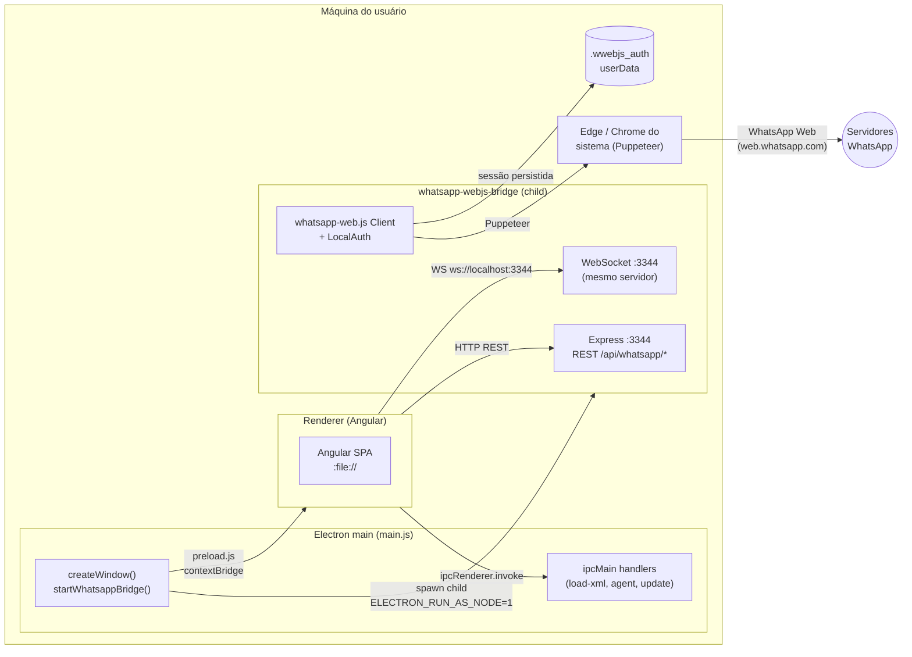
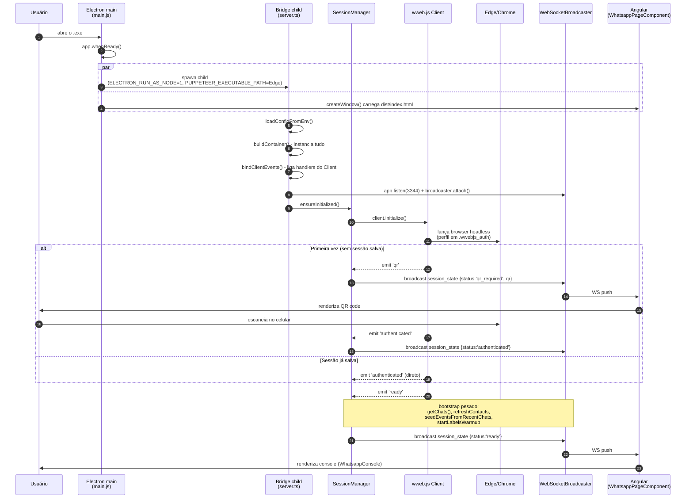
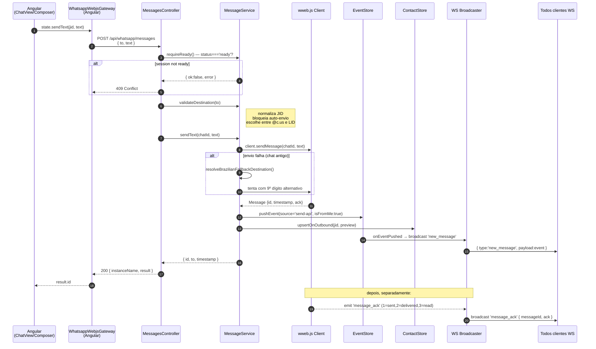
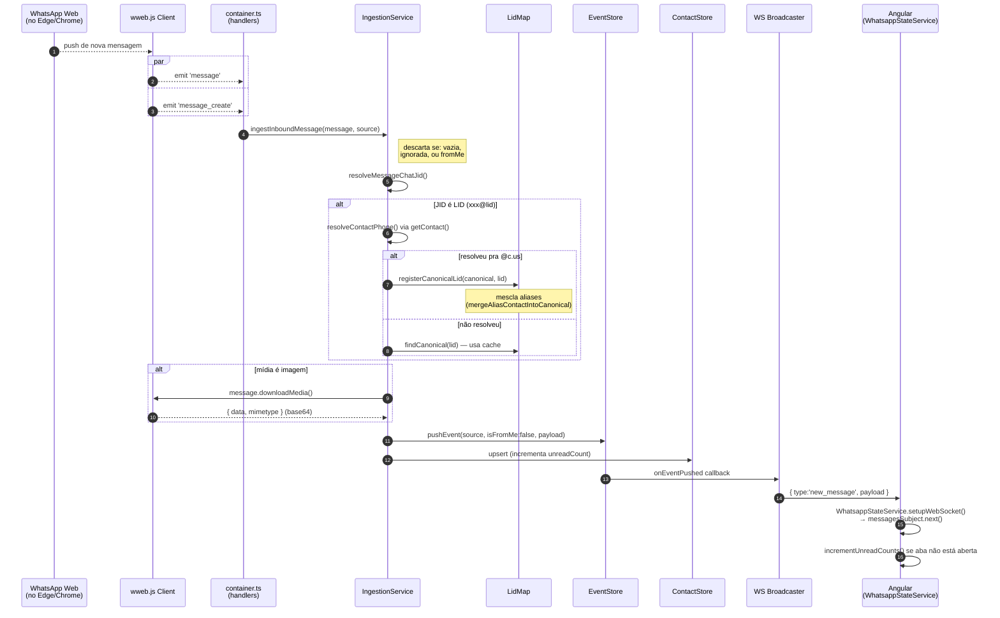

# Arquitetura — Backend

> Foco: o que o **Electron main process** faz e como o **whatsapp-webjs-bridge** funciona por dentro. Use este doc para localizar a causa raiz de bugs de **inicialização**, **envio** e **recebimento** de mensagens.

---

## 1. Visão geral em 30 segundos

O "backend" deste app não é um servidor remoto — é o que roda **dentro da máquina do usuário**, em dois processos:

1. **Electron main process** ([main.js](../main.js)) — abre a janela do Angular, sobe a *bridge* como processo filho, expõe IPC para o renderer (XML, agente Gemini, atualização).
2. **Bridge WhatsApp** ([whatsapp-webjs-bridge/](../whatsapp-webjs-bridge/)) — processo Node.js separado que controla o `whatsapp-web.js` (que por sua vez automatiza um Edge/Chrome do sistema). Expõe REST em `http://localhost:3344` e um WebSocket no mesmo servidor.



**Coisas que costumam confundir:**

- A bridge **não fala HTTP com o WhatsApp**. Ela controla um **navegador real** (Edge ou Chrome do usuário) via Puppeteer, e esse navegador é que conversa com o WhatsApp Web. Se o WhatsApp atualizar o frontend deles, a bridge pode quebrar — por isso [container.ts:79-82](../whatsapp-webjs-bridge/src/container.ts#L79-L82) fixa uma versão conhecida do HTML do WhatsApp Web via `webVersionCache`.
- O Angular roda como **arquivo local** (`file://...`), não em servidor. Por isso o CORS da bridge tem regra especial pra `file://` ([app.ts:18-21](../whatsapp-webjs-bridge/src/app.ts#L18-L21)).
- O Angular **não tem acesso direto** ao Node — ele fala com o Electron main por IPC (`window.electronAPI`, definido em [preload.js](../preload.js)) e com a bridge por HTTP/WS.

---

## 2. Estrutura do código da bridge

```
whatsapp-webjs-bridge/src/
├── server.ts          # entrypoint: main(), guards de erro recuperável
├── app.ts             # Express app + CORS
├── routes.ts          # mapeamento REST → controllers
├── container.ts       # DI: instancia tudo, liga eventos do Client
├── config.ts          # lê env (PORT, ALLOWED_ORIGIN, etc.)
│
├── controllers/       # HTTP handlers (camada fina)
│   ├── HealthController.ts
│   ├── SessionController.ts     # GET /session, POST /session/connect|disconnect
│   ├── ContactsController.ts    # GET /contacts, /contacts/:jid/photo, POST /chats/:jid/seen
│   ├── LabelsController.ts      # GET /labels
│   ├── EventsController.ts      # GET /events
│   ├── HistoryController.ts     # GET /chats/:jid/messages
│   └── MessagesController.ts    # POST /messages, /reply, /forward, /media; DELETE /messages/:id
│
├── whatsapp/          # camada de domínio / regras
│   ├── SessionManager.ts        # initialize/disconnect com retry
│   ├── SelfJidResolver.ts       # quem sou eu (próprio número)
│   ├── ContactsService.ts       # lista de contatos a partir de getChats() + cache
│   ├── HistoryService.ts        # histórico de uma conversa
│   ├── MessageService.ts        # send, reply, media, forward, delete, markSeen
│   └── IngestionService.ts      # ingestão de mensagens recebidas (LID → JID real)
│
├── state/             # estado em memória (não persiste em disco do app)
│   ├── SessionState.ts          # status: initializing|qr_required|authenticated|ready|...
│   ├── EventStore.ts            # ring buffer das últimas 200 mensagens
│   ├── ContactStore.ts          # cache de contatos
│   └── LidMap.ts                # mapa LID (xxx@lid) ↔ telefone (xxx@c.us)
│
├── ws/
│   └── WebSocketBroadcaster.ts  # broadcast pra todos os clientes WS conectados
│
├── domain/types.ts    # tipos compartilhados
└── utils/             # jid, phone, time, media, message, contact, lidResolver
```

### Camadas, em uma frase

- **Controllers** validam input HTTP e chamam services. Não têm regra de negócio.
- **Services (`whatsapp/`)** são onde **mora a lógica**. Bug de envio = `MessageService`. Bug de recebimento = `IngestionService`. Bug de "fica em authenticated pra sempre" = `SessionManager` ou `webVersionCache`.
- **State (`state/`)** é memória pura, sem regra. `EventStore` tem deduplicação por id, `LidMap` resolve a confusão de IDs do WhatsApp.
- **WS broadcaster** é o canal de empurrar eventos pro Angular.

---

## 3. Fluxo de inicialização (ponta-a-ponta)

Aqui é o caminho do **clique no ícone do app** até **a sessão estar pronta** (`status='ready'`).



### Onde cada peça mora

| Etapa | Arquivo | Função |
|---|---|---|
| Spawn da bridge | [main.js:223-297](../main.js#L223-L297) | `startWhatsappBridge()` — encontra Edge/Chrome com `findSystemChromium()`, monta env, faz `spawn(process.execPath, [bridgeEntry])` |
| Bootstrap da bridge | [server.ts:76-100](../whatsapp-webjs-bridge/src/server.ts#L76-L100) | `main()` — config → container → bind events → listen → `ensureInitialized()` |
| Ligação dos eventos do Client | [container.ts:146-423](../whatsapp-webjs-bridge/src/container.ts#L146-L423) | `bindClientEvents` — handlers de `qr`, `authenticated`, `ready`, `auth_failure`, `disconnected`, `message`, `message_create`, `message_ack` |
| Init com retry | [SessionManager.ts:54-110](../whatsapp-webjs-bridge/src/whatsapp/SessionManager.ts#L54-L110) | `ensureInitialized()` + `initializeWithRetry()` — 2 tentativas, faz `client.destroy()` antes da retry |
| Recuperação de erro de lock | [server.ts:13-74](../whatsapp-webjs-bridge/src/server.ts#L13-L74) | `installProcessGuards()` — captura `EBUSY` no LocalAuth e tenta reconectar em 1.2s |
| Bootstrap quando `ready` | [container.ts:289-316](../whatsapp-webjs-bridge/src/container.ts#L289-L316) | dispara `triggerRefresh` (contatos) + `seedEventsFromRecentChats` + `startLabelsWarmup` |

### Estados da sessão

`SessionState.status` ([state/SessionState.ts](../whatsapp-webjs-bridge/src/state/SessionState.ts)) pode ser:

```
initializing → qr_required → authenticated → ready
                                    ↓             ↓
                              auth_failure   disconnected → (auto-recover) → initializing
                                    ↓
                              init_error
```

O Angular (em [whatsapp-page.component.ts:379-446](../src/app/modules/whatsapp/pages/whatsapp-page/whatsapp-page.component.ts#L379-L446)) decide **se mostra o QR**, **se mostra o console** ou **se tenta reconectar** baseado nesse status.

### Sintomas e onde olhar

| Sintoma | Olhe primeiro |
|---|---|
| App abre mas não acha o navegador | [main.js:88-104](../main.js#L88-L104) `findSystemChromium()` |
| Trava em "authenticated" e nunca vira "ready" | `webVersionCache` em [container.ts:79-82](../whatsapp-webjs-bridge/src/container.ts#L79-L82); WhatsApp atualizou o frontend |
| QR não aparece no Angular | Eventos `session_state` no WS — confira [container.ts:160-169](../whatsapp-webjs-bridge/src/container.ts#L160-L169) e o handler em [whatsapp-page.component.ts:79-86](../src/app/modules/whatsapp/pages/whatsapp-page/whatsapp-page.component.ts#L79-L86) |
| Erro `EBUSY` em `LocalAuth.js` | Esperado — guard recupera ([server.ts:13-74](../whatsapp-webjs-bridge/src/server.ts#L13-L74)) |
| Bridge cai com `EADDRINUSE` 3344 | Outra instância já está rodando — bridge encerra com exit 0 ([server.ts:102-107](../whatsapp-webjs-bridge/src/server.ts#L102-L107)) |
| Logs da bridge | `error/bridge-YYYY-MM-DD.log` na pasta de instalação ou em `userData` ([main.js:33-86](../main.js#L33-L86)) |

---

## 4. Fluxo de envio de mensagem



### Pontos importantes

- **`sendWithBrazilianAlternative`** ([MessageService.ts](../whatsapp-webjs-bridge/src/whatsapp/MessageService.ts)) constrói uma lista de **candidatos** e tenta cada um em ordem: (1) JID preferido baseado em score de quão "conhecido" é o contato, (2) JID original como recebido, (3) variante alternativa do 9º dígito (sem/com 9). Se todos falharem, faz uma última tentativa via `client.getNumberId()` pra perguntar ao próprio WhatsApp Web qual é o JID canônico. Mensagem que parecia falhar pode ter sido entregue por uma dessas variantes — o JID efetivo está no `event.chatJid` do `EventStore`.
- **LID vs JID**: WhatsApp usa dois IDs pro mesmo contato: `554199999999@c.us` e `xxxxx@lid`. `MessageService.registerLidFromSentMessage` ([MessageService.ts:285-322](../whatsapp-webjs-bridge/src/whatsapp/MessageService.ts#L285-L322)) aprende o mapeamento toda vez que envia, salvando em `LidMap`.
- **Mídia** ([MessageService.ts:133-202](../whatsapp-webjs-bridge/src/whatsapp/MessageService.ts#L133-L202)): converte buffer pra base64, manda como `MessageMedia`. Imagem vai como imagem, resto vai como documento (`sendMediaAsDocument: !isImage`).
- **Reply** ([MessageService.ts:324-368](../whatsapp-webjs-bridge/src/whatsapp/MessageService.ts#L324-L368)): mesmo código, só passa `quotedMessageId` no options.
- **ACK não é síncrono** — o número volta depois, via evento `message_ack`. Quando o ACK chega, [container.ts:371-380](../whatsapp-webjs-bridge/src/container.ts#L371-L380) atualiza `EventStore`, propaga pro contato e faz broadcast.

### Endpoints REST de envio

| Método | Rota | Quem trata |
|---|---|---|
| POST | `/api/whatsapp/messages` | `MessagesController.sendText` |
| POST | `/api/whatsapp/messages/reply` | `MessagesController.replyMessage` |
| POST | `/api/whatsapp/messages/forward` | `MessagesController.forwardMessage` |
| POST | `/api/whatsapp/messages/media` | `MessagesController.sendMedia` (multipart, multer) |
| DELETE | `/api/whatsapp/messages/:messageId` | `MessagesController.deleteMessage` |

---

## 5. Fluxo de recebimento de mensagem

Acontece **sem que ninguém peça** — os eventos vêm do `whatsapp-web.js` Client, que escuta pushes do WhatsApp Web.



### Pontos importantes

- **`message` vs `message_create`**: o WhatsApp emite **os dois eventos** pra mensagens recebidas. O handler em [container.ts](../whatsapp-webjs-bridge/src/container.ts) usa `message_create` também pra capturar **mensagens enviadas em outro dispositivo** (você responde no celular, app reflete) — chama `ingestOutboundFromCreate` nesse caso.
- **Deduplicação de mensagens**: `EventStore.recentEventIds` ([EventStore.ts](../whatsapp-webjs-bridge/src/state/EventStore.ts)) impede que a mesma mensagem entre duas vezes (porque `message` e `message_create` chegam ambos).
- **Dedup de contato LID**: `registerCanonicalLid` em [IngestionService.ts](../whatsapp-webjs-bridge/src/whatsapp/IngestionService.ts) e [ContactsService.ts](../whatsapp-webjs-bridge/src/whatsapp/ContactsService.ts) **sempre chama `mergeAliasContactIntoCanonical`** após aprender um mapeamento, mesmo quando não há canonical "deslocado" pra mesclar. Isso garante que se o LID já tinha sido criado como contato órfão (típico quando o getChats refresh corre antes da gente aprender o mapeamento via inbound), ele é absorvido no canonical em vez de ficar duplicado.
- **LID não resolvido** — se uma mensagem chega com JID `xxxxx@lid` e a bridge não consegue resolver pro `@c.us`, ela **mantém o LID** mas notifica `onUnresolvedLid`, que dispara um `triggerRefresh` de contatos pra tentar descobrir mais tarde ([container.ts](../whatsapp-webjs-bridge/src/container.ts)).
- **Mídia inline**: imagens são baixadas no momento da ingestão e viram `data:image/...;base64,...` no payload. **Documentos não são baixados aqui** — apenas mimetype e filename são guardados.
- **Mensagens de grupo são descartadas** ([IngestionService.ts:119-122](../whatsapp-webjs-bridge/src/whatsapp/IngestionService.ts#L119-L122)). O sistema só lida com 1:1.

### Sintomas e onde olhar

| Sintoma | Olhe primeiro |
|---|---|
| Mensagem dupla na conversa | Provavelmente o `recentEventIds` não pegou — confira IDs serializados em [EventStore.ts:53-96](../whatsapp-webjs-bridge/src/state/EventStore.ts#L53-L96) |
| Mensagem entra mas o nome do contato é o LID feio (números aleatórios) | `IngestionService.resolveContactPhone` falhou — veja [IngestionService.ts:142-177](../whatsapp-webjs-bridge/src/whatsapp/IngestionService.ts#L142-L177) e `utils/lidResolver.ts` |
| Imagem chega como mensagem vazia | Download da mídia falhou silenciosamente — [IngestionService.ts:304-316](../whatsapp-webjs-bridge/src/whatsapp/IngestionService.ts#L304-L316) |
| ACK não atualiza no Angular | Handler `message_ack` em [container.ts:371-380](../whatsapp-webjs-bridge/src/container.ts#L371-L380); WS `message_ack` no Angular ([whatsapp-state.service.ts:219-238](../src/app/modules/whatsapp/services/whatsapp-state.service.ts#L219-L238)) |
| Conversa enviada do celular não aparece | `ingestOutboundFromCreate` ([IngestionService.ts:392-477](../whatsapp-webjs-bridge/src/whatsapp/IngestionService.ts#L392-L477)) |

---

## 6. Eventos WebSocket — contrato

A bridge **só empurra**, nunca recebe. O Angular se conecta em `ws://localhost:3344` e escuta:

| `type` | Quando dispara | Payload |
|---|---|---|
| `session_state` | mudança de status, QR novo | `SessionSnapshot` (status, qr, jid, lastError) |
| `new_message` | qualquer mensagem nova entra no `EventStore` (recebida OU enviada por aqui) | `WhatsappEvent` |
| `message_ack` | `message_ack` do Client | `{ messageId, ack }` |
| `contacts_updated` | refresh de contatos terminou e algo mudou | `{ contacts: WhatsappContact[] }` |
| `labels_updated` | poll de etiquetas a cada 30s, ou quando estão mudaram no celular | `{ labels: WhatsappLabel[] }` |

`session_state` e `labels_updated` são **snapshots** — quando um cliente WS novo conecta, o broadcaster reenvia o último snapshot ([WebSocketBroadcaster.ts:40-56](../whatsapp-webjs-bridge/src/ws/WebSocketBroadcaster.ts#L40-L56)). Os outros eventos não são repostos.

---

## 7. Persistência

A bridge **não tem banco**. Tudo é volátil exceto:

- **Sessão do WhatsApp**: em `userData/.wwebjs_auth/` (config do `LocalAuth`, [container.ts:60-70](../whatsapp-webjs-bridge/src/container.ts#L60-L70)). Caminho vem do env `WWEBJS_DATA_PATH` que o Electron passa.
- **Cache do `whatsapp-web.js`**: em `userData/.wwebjs_cache/`.
- **Logs**: `error/bridge-YYYY-MM-DD.log` na pasta de instalação (ou em `userData` se Program Files bloqueou). Veja `getErrorLogDir()` em [main.js:33-58](../main.js#L33-L58).
- **EventStore**: ring buffer de 200 mensagens **em memória** ([EventStore.ts:5](../whatsapp-webjs-bridge/src/state/EventStore.ts#L5)). Reinicia com a bridge.

> Se o usuário reclamar que "as mensagens antigas sumiram" depois de reiniciar o app, esse é o motivo. O Angular tem que repuxar via `GET /events` ou `GET /chats/:jid/messages` (que usa o histórico do `whatsapp-web.js`, não o `EventStore`).

---

## 8. IPC do Electron (não-bridge)

Coisas que **não** passam pela bridge — vão direto pelo IPC main↔renderer ([main.js:771-879](../main.js#L771-L879), expostas em [preload.js](../preload.js)):

| Canal IPC | O que faz |
|---|---|
| `load-xml` | Lê o primeiro `.xml` da pasta de instalação (lista de clientes) |
| `agent:open-window` | Abre janela de Gemini Gem (BrowserWindow separada com partition por conta Google) |
| `agent:generate-suggestion` | Manda prompt pro Gemini, lê DOM, devolve resposta |
| `app:get-version` | `app.getVersion()` |
| `app:check-update` | Compara versão remota com a local |
| `app:install-update` | Baixa o `.exe` novo, abre, encerra o app |

Esses IPC handlers ficam **inteiros em `main.js`** — se o bug é "atualização não funciona" ou "agente Gemini falha", é lá, não na bridge.
