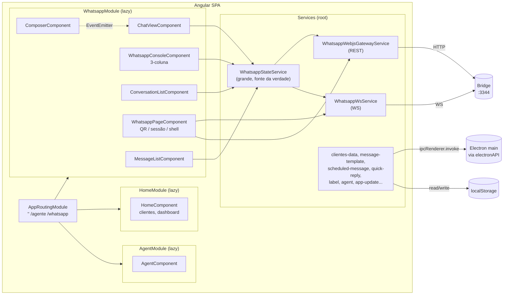
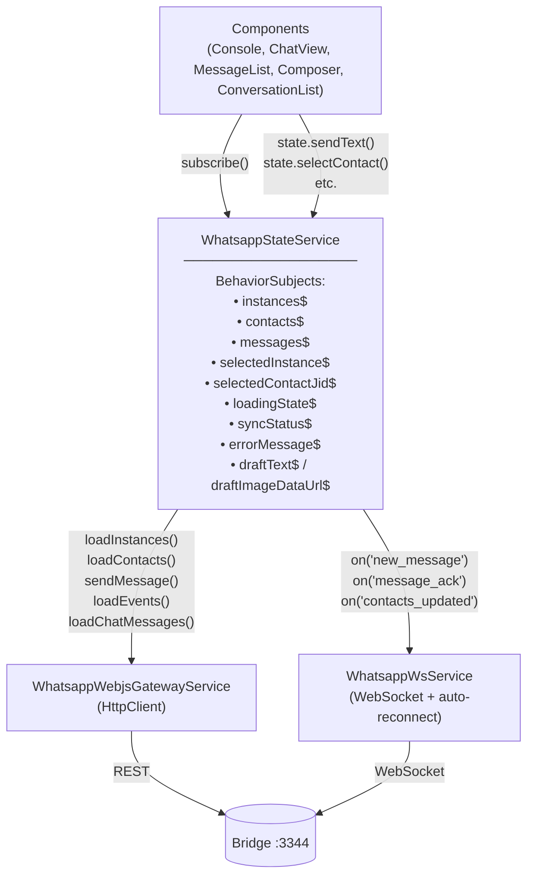
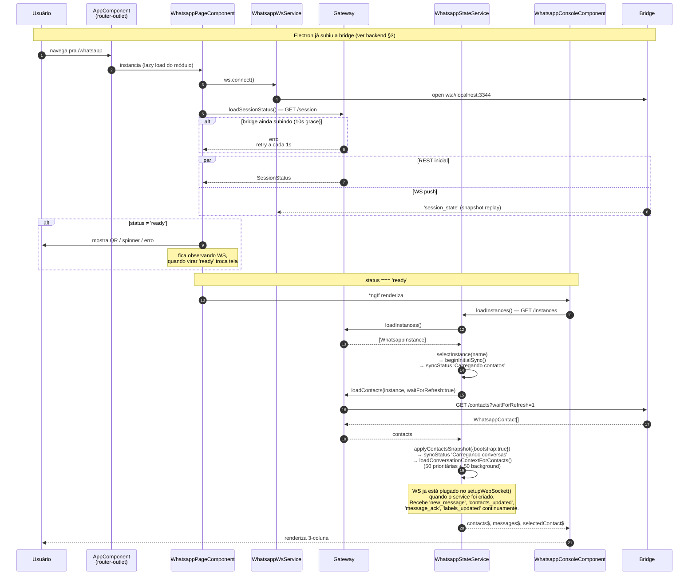
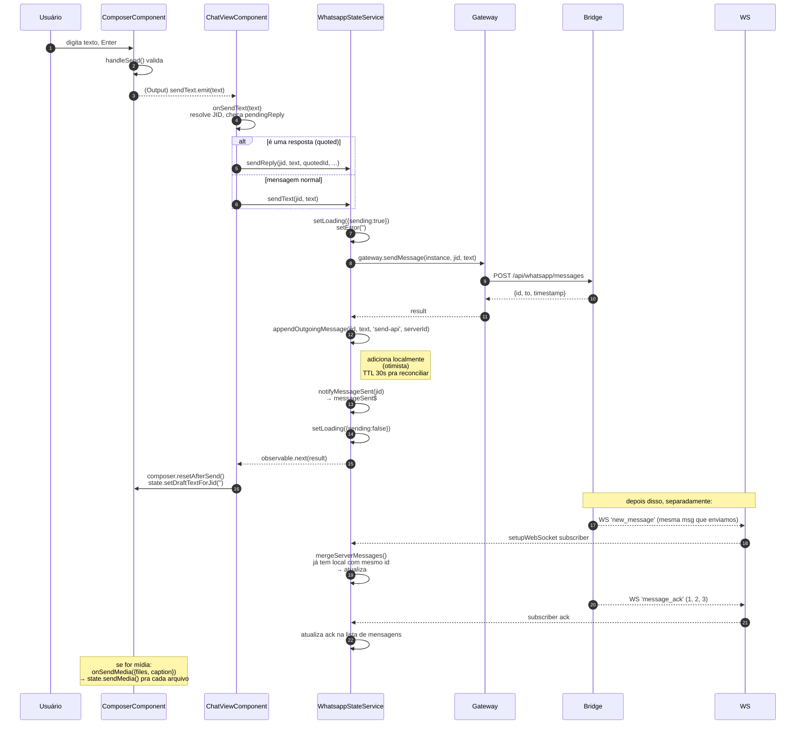
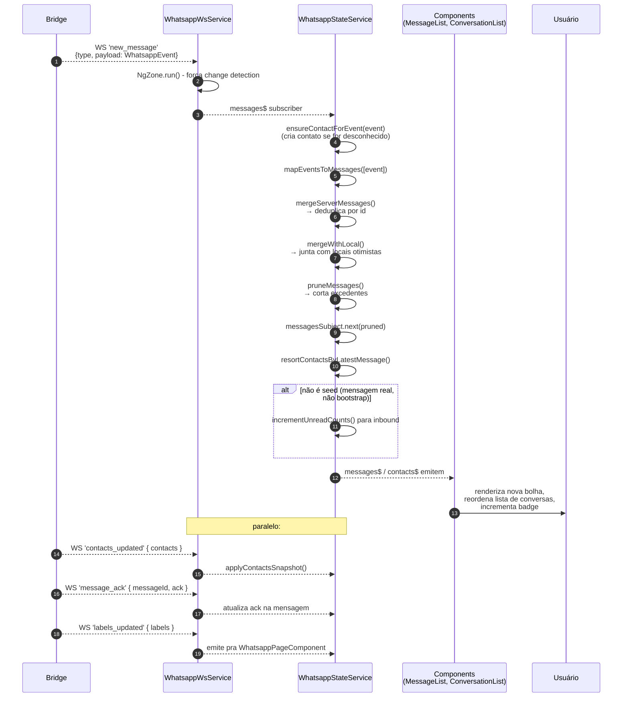

# Arquitetura — Frontend (Angular)

> Foco: como o renderer Angular está organizado e como ele conversa com a bridge. Use este doc para localizar a causa raiz de bugs que aparecem **na tela** — UI, estado, sincronia.
>
> Pré-requisito: leia [architecture-backend.md](./architecture-backend.md) antes — boa parte do que o front faz é só **espelhar** estado da bridge via WebSocket.

---

## 1. Visão geral em 30 segundos

O front é um **Angular 15 SPA** rodando como `file://` dentro do Electron. Não tem servidor — quando empacotado, o Electron carrega `dist/uniq-system/index.html`.

Ele se comunica com **três** coisas:

1. **Bridge WhatsApp** via HTTP (`http://localhost:3344/api/whatsapp/*`) e WebSocket (`ws://localhost:3344`).
2. **Electron main** via `window.electronAPI` ([preload.js](../preload.js)) — pra XML, Gemini, atualização.
3. **localStorage** — pra preferências, templates, agendamentos, quick replies (tudo cliente-side).



**O que confunde no começo:**

- **`WhatsappStateService` é o cérebro do módulo WhatsApp** ([modules/whatsapp/services/whatsapp-state.service.ts](../src/app/modules/whatsapp/services/whatsapp-state.service.ts), 2.3k linhas). Quase tudo o que aparece na tela do chat passa por ele. Se você está perdido num bug do chat, **comece por aí**.
- O front **não chama `connect()`** explicitamente — quem inicializa a sessão é a própria bridge no boot ([architecture-backend.md §3](./architecture-backend.md#3-fluxo-de-inicialização-ponta-a-ponta)). O front **observa** o status via WS e decide se mostra QR ou console.
- Tem **dois services de gateway** com nomes parecidos:
  - [whatsapp-gateway.service.ts](../src/app/services/whatsapp-gateway.service.ts) — antigo, usado em outras integrações
  - [whatsapp-webjs-gateway.service.ts](../src/app/services/whatsapp-webjs-gateway.service.ts) — **o que importa**, fala com a bridge
- O `HomeComponent` (rota `/`) é a **dashboard de clientes** — lê XML, mostra agendamentos. Não tem nada de WhatsApp ali. O WhatsApp é todo em `/whatsapp`.

---

## 2. Estrutura do código

```
src/app/
├── app.module.ts                      # bootstrap mínimo
├── app-routing.module.ts              # 3 lazy modules: '', /agente, /whatsapp
├── app.component.{ts,html,scss}       # casca, só <router-outlet>
│
├── components/                        # componentes compartilhados/standalone
│   ├── about-modal/
│   ├── app-page-header/
│   ├── app-shell-sidebar/             # menu lateral comum
│   ├── clientes-table/
│   ├── label-manager-modal/
│   ├── message-template-modal/
│   ├── quick-reply-manager-modal/
│   ├── schedule-list-modal/
│   ├── schedule-modal/
│   ├── schedule-notification/
│   ├── upload-xml-modal/
│   └── whatsapp-icon/
│
├── helpers/                           # funções puras (datas, XML, formato)
├── models/                            # interfaces TS
│
├── services/                          # services no nível root (singletons)
│   ├── whatsapp-webjs-gateway.service.ts    # ★ REST → bridge
│   ├── whatsapp-ws.service.ts               # ★ WebSocket → bridge
│   ├── whatsapp-gateway.service.ts          # legado
│   ├── clientes-data.service.ts             # XML/IPC + localStorage
│   ├── message-template.service.ts          # templates de mensagem
│   ├── quick-reply.service.ts               # quick replies (atalhos)
│   ├── label.service.ts                     # etiquetas locais
│   ├── scheduled-message.service.ts         # agendamentos
│   ├── pending-bulk-send.service.ts         # envio em massa
│   ├── manager-launch.service.ts            # abre modais a partir de qualquer lugar
│   ├── schedule-list-launcher.service.ts
│   ├── theme.service.ts
│   ├── agent.service.ts                     # config do agente Gemini
│   └── app-update.service.ts                # auto-update
│
└── modules/
    ├── home/                          # rota '' — dashboard de clientes
    │   ├── home.module.ts
    │   ├── home-routing.module.ts
    │   └── home.component.{ts,html,scss}
    │
    ├── agent/                         # rota '/agente' — config do Gemini
    │
    ├── whatsapp/                      # rota '/whatsapp' — TUDO do chat
    │   ├── whatsapp.module.ts
    │   ├── whatsapp-routing.module.ts
    │   ├── pages/whatsapp-page/                    # gate de sessão (QR ou console)
    │   ├── components/
    │   │   ├── whatsapp-console/                   # ★ 3-coluna (lista|chat|painel)
    │   │   ├── conversation-list/                  # coluna esquerda
    │   │   ├── chat-header/
    │   │   ├── chat-view/                          # ★ orquestrador da conversa
    │   │   ├── message-list/                       # bolhas
    │   │   ├── composer/                           # ★ caixa de texto + anexos
    │   │   ├── quick-reply-menu/                   # autocomplete de '/'
    │   │   ├── contact-avatar/
    │   │   ├── label-picker-popover/
    │   │   ├── bulk-action-bar/
    │   │   ├── bulk-task-panel/
    │   │   └── bulk-label-modal/
    │   ├── services/
    │   │   ├── whatsapp-state.service.ts           # ★★★ FONTE DA VERDADE do chat
    │   │   ├── bulk-send.service.ts                # fila de envio em massa
    │   │   └── assistant-feedback.service.ts       # feedback IA
    │   └── helpers/                                # phone-format, etc.
    │
    ├── tagplus/                       # integração TagPlus (legado/auxiliar)
    ├── gem-lab/                       # ferramenta interna de testes
    └── shared/                        # SharedModule comum aos módulos lazy
```

### O que cada coluna do console faz

```
┌────────────────────┬──────────────────────────┬──────────────────┐
│ ConversationList   │ ChatView                 │ (BulkTaskPanel)  │
│  (esquerda)        │  ├─ ChatHeader           │  só aparece em   │
│                    │  ├─ MessageList          │  modo bulk       │
│  - lista contatos  │  └─ Composer             │                  │
│  - filtros/busca   │                          │                  │
│  - seleção bulk    │                          │                  │
└────────────────────┴──────────────────────────┴──────────────────┘
```

Tudo está dentro de [whatsapp-console.component.html](../src/app/modules/whatsapp/components/whatsapp-console/whatsapp-console.component.html).

---

## 3. Camada de dados — quem fala com quem



### Por que o `WhatsappStateService` ficou tão grande

Porque **ele resolve sozinho** todos os casos chatos do WhatsApp:

- **Mensagens locais otimistas**: quando o usuário envia, aparece na hora (`appendOutgoingMessage`), sem esperar a bridge confirmar. Mantém uma TTL de 30s pra reconciliar com o id real do servidor.
- **Merge de servidor + local**: `mergeServerMessages` + `mergeWithLocal` + `pruneMessages` — porque a mesma mensagem pode chegar via 3 caminhos (envio, WS push, GET /events).
- **LID/JID**: o front também mantém um índice (`contactIndexByKey`) pra resolver "este chat com `xxxxx@lid` é o mesmo do `5541999@c.us`?" via `findEquivalentContact`.
- **Sincronização inicial em fases**: `beginInitialSync` → carrega contatos → `beginInitialConversationPhase` → carrega 50 conversas prioritárias em paralelo (concurrency=6) → mais 50 em background.
- **Drafts por JID**: cada conversa lembra o texto digitado (`draftTextByJidSubject`).
- **Fotos com retry**: se um contato volta `null` na foto, tenta de novo só depois de 30 min (`PHOTO_NULL_RETRY_MS`).
- **Unread counts**: incrementa quando chega mensagem **se** a sincronização inicial já acabou e a aba não está aberta nesse contato.

Tudo isso é **estado do cliente**, não da bridge. Bug de "lista de conversas com ordem errada", "mensagem some quando troco de chat", "foto não aparece" — provavelmente está aqui.

---

## 4. Fluxo de inicialização (ponta-a-ponta)



### Pontos importantes

- **A bridge não espera o front** — ela já começou a init quando o front sequer existia. O front **descobre** o status atual via REST + WS.
- **Bootstrap dos contatos com retry generoso**: a chamada inicial `loadContacts({bootstrap: true})` faz `waitForRefresh: true` (bridge pode bloquear até 90s). Se devolver 0 contatos, retenta até **5 vezes** (`BOOTSTRAP_CONTACTS_MAX_RETRIES`), todas com `waitForRefresh: true`. Pior caso: ~7.5 min de "Carregando contatos". Já testei reduzir esse retry pra 2× com a 2ª usando `waitForRefresh: false` — o app passou a abrir com lista incompleta no primeiro boot após scan de QR (a lib do whatsapp-web.js demora pra popular getChats nesse cenário). Mantemos a espera longa porque correção > velocidade.
- **Snapshot replay no WS**: assim que o `WhatsappWsService` conecta, a bridge manda os snapshots de `session_state` e `labels_updated` ([WebSocketBroadcaster.ts:50-55](../whatsapp-webjs-bridge/src/ws/WebSocketBroadcaster.ts#L50-L55)). Isso é o que evita corrida de "front conectou antes do `ready` ser broadcastado".
- **Auto-reconnect do WS**: backoff exponencial de 3s até 30s ([whatsapp-ws.service.ts:99-107](../src/app/services/whatsapp-ws.service.ts#L99-L107)). Se a bridge for reiniciada, o front reconecta sozinho.
- **Grace period de 10s**: o `WhatsappPageComponent` ignora erros de `loadSessionStatus` durante os primeiros 10s pra não mostrar erro enquanto a bridge ainda está subindo ([whatsapp-page.component.ts:17, 281-300](../src/app/modules/whatsapp/pages/whatsapp-page/whatsapp-page.component.ts#L17)).
- **`WhatsappStateService` é singleton root** — sobrevive a navegações entre rotas. Se você sai de `/whatsapp` e volta, o estado **continua** lá (incluindo as conversas já carregadas).

### Sintomas e onde olhar

| Sintoma | Olhe primeiro |
|---|---|
| Tela trava em "Verificando sessão" | Bridge não respondeu — confira logs da bridge ou `BRIDGE_STARTUP_GRACE_PERIOD_MS` em [whatsapp-page.component.ts:17](../src/app/modules/whatsapp/pages/whatsapp-page/whatsapp-page.component.ts#L17) |
| QR não aparece embora bridge tenha emitido | Confira se WS conectou — [whatsapp-ws.service.ts:67-72](../src/app/services/whatsapp-ws.service.ts#L67-L72); handler em [whatsapp-page.component.ts:79-86](../src/app/modules/whatsapp/pages/whatsapp-page/whatsapp-page.component.ts#L79-L86) |
| Console fica em branco depois do `ready` | `loadInstances`/`loadContacts` falhou — `errorMessage$` em [whatsapp-state.service.ts:1186-1212](../src/app/modules/whatsapp/services/whatsapp-state.service.ts#L1186-L1212); confira aba Network do DevTools |
| Etiquetas não aparecem | Sessão ficou pronta antes da bridge conseguir ler etiquetas — retry em [whatsapp-page.component.ts:496-583](../src/app/modules/whatsapp/pages/whatsapp-page/whatsapp-page.component.ts#L496-L583) (até 8 tentativas) |
| Status volta pra "disconnected" rapidamente e volta | `shouldDeferSessionDowngrade` ([whatsapp-page.component.ts:448-473](../src/app/modules/whatsapp/pages/whatsapp-page/whatsapp-page.component.ts#L448-L473)) atrasa downgrades transientes em 5s — sem isso a UI piscaria |

---

## 5. Fluxo de envio de mensagem



### Pontos importantes

- **A mensagem já aparece na tela antes da bridge confirmar** — `appendOutgoingMessage` adiciona um item local com o `serverId` (se já veio) ou um id local. Quando o WS empurra `new_message` com o mesmo id, ela é mesclada (não duplicada).
- **Drafts**: o composer salva por JID em `setDraftTextForJid`. Trocar de conversa preserva o que estava digitado.
- **Composer é "burro"** ([composer.component.ts](../src/app/modules/whatsapp/components/composer/composer.component.ts)) — só dispara `EventEmitter`s. Quem decide se é envio normal ou reply é o `ChatViewComponent`.
- **Quick replies**: digitar `/` abre o `QuickReplyMenuComponent` ([composer.component.ts:10](../src/app/modules/whatsapp/components/composer/composer.component.ts#L10)). É 100% client-side, salvo via `QuickReplyService` em localStorage.
- **Bulk send**: tem uma fila própria (`BulkSendService`). Quando ativa, o composer não reseta após enviar — porque vai mandar pra próxima.

### Sintomas e onde olhar

| Sintoma | Olhe primeiro |
|---|---|
| Mensagem não aparece após envio | `appendOutgoingMessage` em [whatsapp-state.service.ts](../src/app/modules/whatsapp/services/whatsapp-state.service.ts) (busque pelo nome); ou erro na bridge (409 = não pronto, 400 = JID inválido) |
| Mensagem aparece duplicada | `mergeServerMessages` não reconciliou — confira `id` que o servidor devolveu vs id local |
| Texto enviado fica preso no campo | `composer.resetAfterSend()` não foi chamado — confira erro na callback do `subscribe` em [chat-view.component.ts:295-313](../src/app/modules/whatsapp/components/chat-view/chat-view.component.ts#L295-L313) |
| Envio de mídia abre dois | Composer permite múltiplos arquivos; `onSendMedia` itera ([chat-view.component.ts:317-348](../src/app/modules/whatsapp/components/chat-view/chat-view.component.ts#L317-L348)). O caption só vai no primeiro |
| Reply não cita a mensagem | Confira `quotedReply` em `onSendText` ([chat-view.component.ts:282-291](../src/app/modules/whatsapp/components/chat-view/chat-view.component.ts#L282-L291)) e o estado `pendingReply` |

---

## 6. Fluxo de recebimento de mensagem



### Pontos importantes

- **`NgZone.run()`** é crítico ([whatsapp-ws.service.ts:67-72, 78](../src/app/services/whatsapp-ws.service.ts#L67-L72)): sem isso, o Angular não detecta mudança nas mensagens vindas do WebSocket (porque WS roda fora da zona).
- **Toda mensagem nova passa pelo pipeline** `mapEvents → mergeServer → mergeLocal → prune`. Se uma bolha aparece "estranha" (sem texto, com texto duplicado, sem mídia), o problema está nesse pipeline ou no `mapEventsToMessages`.
- **Lista de conversas é re-ordenada por mensagem mais recente** (`resortContactsByLatestMessage`). Se a ordem não bate com WhatsApp oficial, é onde olhar.
- **Unread counts são clientside** — a bridge incrementa a sua própria contagem no `ContactStore`, mas o front mantém **a sua**, que ele acha mais correta (porque sabe se a janela está com a aba do contato aberta).
- **`message_ack`**: muda o ícone do tique (1=enviado, 2=entregue, 3=visto). Atualização é direta no array de mensagens — sem necessidade de buscar de novo.

### Sintomas e onde olhar

| Sintoma | Olhe primeiro |
|---|---|
| Mensagem nova só aparece se eu trocar de conversa | `NgZone.run()` em [whatsapp-ws.service.ts:67, 78](../src/app/services/whatsapp-ws.service.ts#L67) — se removeu, change detection não dispara |
| Badge de não lidas explode | `incrementUnreadCounts` ([whatsapp-state.service.ts:211-216](../src/app/modules/whatsapp/services/whatsapp-state.service.ts#L211-L216)) está sendo chamado durante seed; cheque `isSyntheticSeedSource` |
| Conversa some da lista quando recebe mensagem | `ensureContactForEvent` falhou (provavelmente LID não resolvido); olhe os logs da bridge pra ver se o JID está como `xxx@lid` |
| Tique não atualiza | Handler `message_ack` em [whatsapp-state.service.ts:219-238](../src/app/modules/whatsapp/services/whatsapp-state.service.ts#L219-L238); confira se `messageId` vindo do WS bate com o `id` da mensagem local |
| Mensagem entra duas vezes no histórico | `mergeServerMessages` deve deduplicar por id — se o id está vazio (`''`), a deduplicação falha. Olhe se a bridge está populando `id._serialized` |
| Contato fica como número cru sem nome | `applyContactsSnapshot` substituiu nome por phone — pode estar perdendo o nome no merge; busque por `applyContactsSnapshot` |

---

## 7. Como o front se comporta com falhas

| Falha | Comportamento |
|---|---|
| Bridge não responde no boot | Grace de 10s, depois mostra "Não foi possível validar a sessão" com botão "Tentar novamente" |
| WS cai durante uso | Reconnect com backoff (3s → 4.5s → 6.75s ... → 30s). Mensagens enquanto offline **se perdem** (não há fila no servidor) — quando volta, snapshot de `session_state`/`labels_updated` é reposto, mas `new_message` não |
| Sessão vai pra `disconnected` | UI volta pro gate de QR, mostra botão "Gerar novo QR code". Estado das conversas no `WhatsappStateService` **fica em memória** mas não é mais atualizado |
| Erro 409 ao enviar (não pronto) | `setError('Não foi possível enviar a mensagem.')` — toast some sozinho em 4s ([whatsapp-console.component.ts:18](../src/app/modules/whatsapp/components/whatsapp-console/whatsapp-console.component.ts#L18)) |
| Erro 400 (JID inválido / auto-envio) | Mesmo toast — `resolveSendErrorMessage` extrai detalhes do response da bridge |

---

## 8. Persistência cliente-side (localStorage)

Coisas que o front salva sozinho (não vão pra bridge):

| Service | O que salva |
|---|---|
| `MessageTemplateService` | Templates de mensagem (aniversário, cobrança, etc.) com placeholders `{nome}` |
| `QuickReplyService` | Atalhos `/` digitáveis no composer |
| `LabelService` | Etiquetas locais (separado das do WhatsApp) |
| `ScheduledMessageService` | Mensagens agendadas (com recorrência) |
| `PendingBulkSendService` | Estado de envio em massa em curso |
| `AgentService` | URL do Gem do Gemini, conta Google, modo de resposta |
| `ThemeService` | Tema claro/escuro |
| `ClientesDataService` | Cache do XML carregado |

> Quando o usuário reclama "perdi meus templates", "agendamentos sumiram" — provavelmente foi o `userData` que mudou (Electron faz separação dev/prod, ver [main.js:9-11](../main.js#L9-L11)).

---

## 9. Atalho mental para debugar

Quando aparecer um bug do chat, pergunte nessa ordem:

1. **A bridge está respondendo?** Abre `http://localhost:3344/api/health` no DevTools (Console → fetch). Se não responde → problema de bridge.
2. **O WS está conectado?** No DevTools → Network → WS → tem que ter um socket pra `:3344` aberto, recebendo eventos. Se não → problema de bridge ou de [whatsapp-ws.service.ts](../src/app/services/whatsapp-ws.service.ts).
3. **O `WhatsappStateService` recebeu o evento?** Coloca um `console.log` em `setupWebSocket` ([whatsapp-state.service.ts:194-249](../src/app/modules/whatsapp/services/whatsapp-state.service.ts#L194-L249)).
4. **O componente reagiu?** O `state.messages$` emite, mas o `MessageListComponent` não renderiza? → problema de change detection (`NgZone`) ou template.
5. **A UI está certa mas o estado está errado?** → problema de **regra** dentro do `WhatsappStateService` (merge, prune, sort, unread).

A maioria dos bugs cai em (1) ou (5). Bug em (2)/(3)/(4) é raro porque o pipeline já foi bastante batido.
